<h1 align='center'>🌟 Bot de Discord de One Piece 🤖🏴‍☠️ 🌟</h1>

> Práctica con Node.js y Express. ✨

🎯 **Objetivo:** Crear un bot de Discord para practicar el consumo de APIs como Discord.js, así como las APIs de One Piece y Giphy.

---

### Comandos ⌨️

#### 📌 `!addSensitiveRole` 
Este comando permite a los administradores agregar un rol específico, identificado por su ID, a una lista de roles autorizados. Los usuarios con estos roles tendrán permisos especiales para ejecutar ciertos comandos sensibles que están restringidos para la mayoría de los miembros.

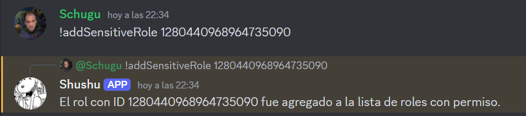

#### 📌 `!api` 
Muestra el enlace a la API de One Piece.

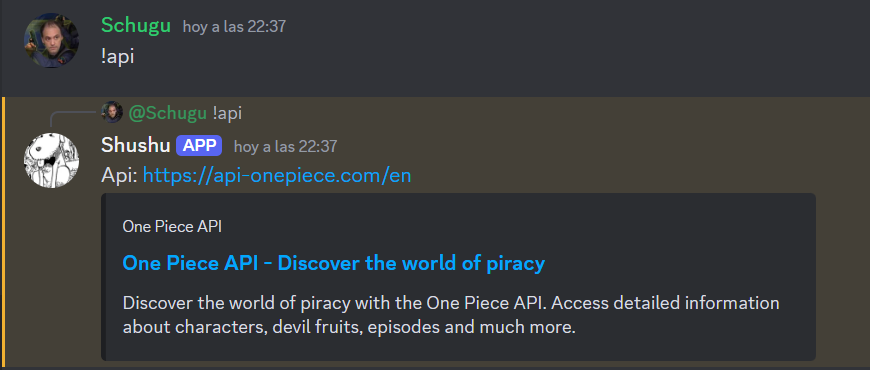

#### 📌 `!avatar` 
Muestra la foto de perfil de uno mismo o de un usuario mencionado.

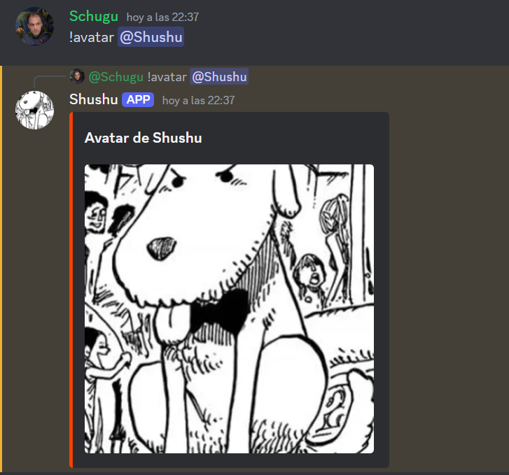

#### 📌 `!clear` 
Elimina todos los mensajes del chat o una cantidad especificada. Se requieren permisos especiales para ejecutarlo.

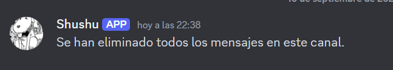

#### 📌 `!crews` 
Muestra todas las tripulaciones de One Piece.

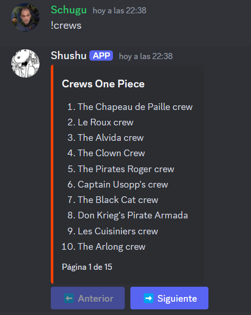

#### 📌 `!crew {crew}` 
Busca información sobre una tripulación específica de One Piece.

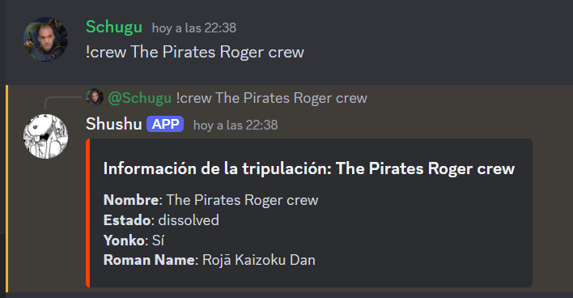

#### 📌 `!fruits` 
Muestra todas las frutas del diablo de One Piece.

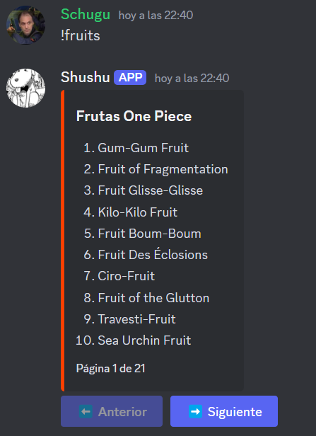

#### 📌 `!fruit {fruit}` 
Busca información sobre una fruta del diablo específica de One Piece.

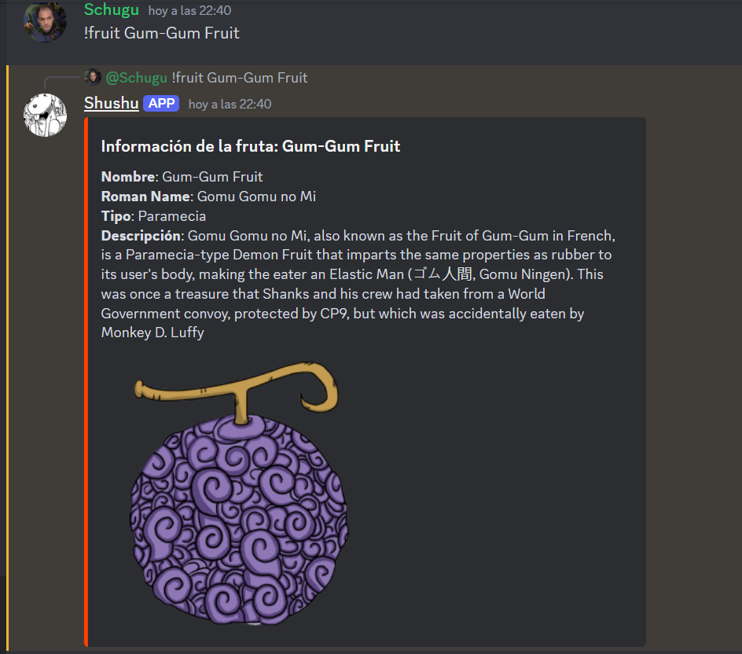

#### 📌 `!gif {nameGif}` 
Muestra un gif relacionado con el nombre especificado.

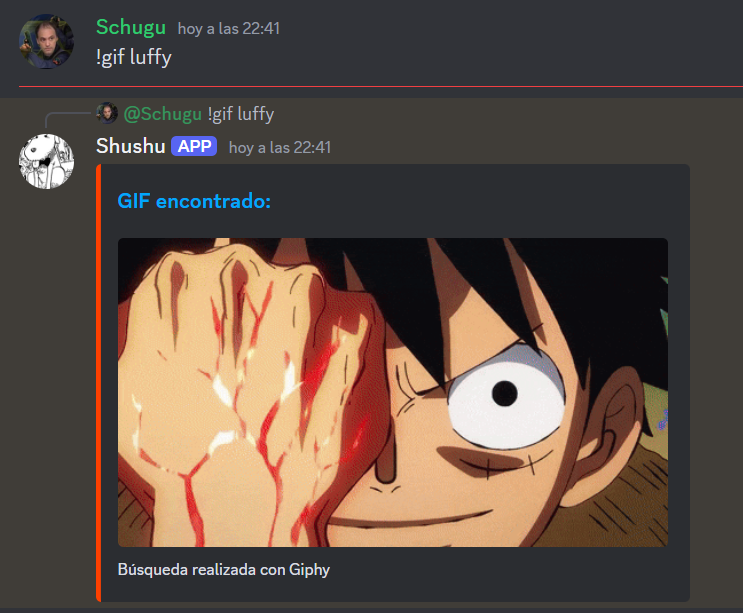

#### 📌 `!owner`
Detecta quién es el dueño del servidor y muestra su nombre y foto de perfil.

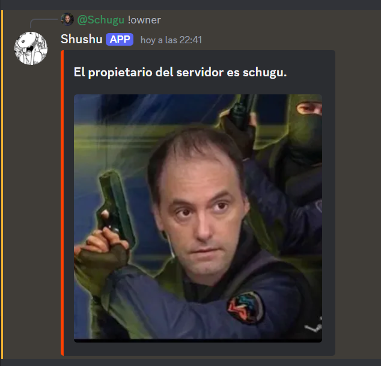

#### 📌 `!pjs` 
Muestra todos los personajes de One Piece.

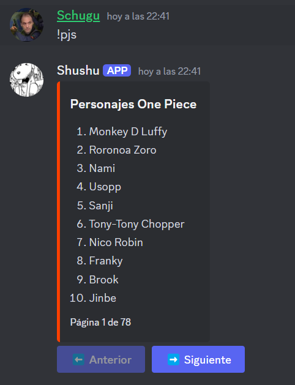

#### 📌 `!pjs {pj}` 
Busca información sobre un personaje específico de One Piece.

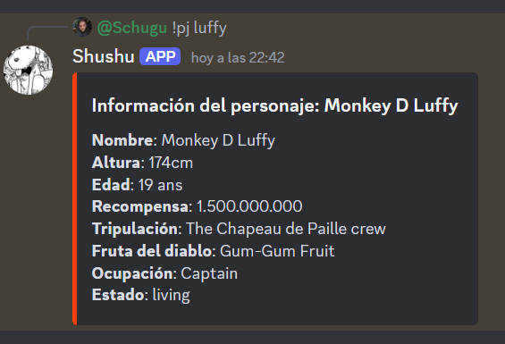

#### 📌 `!say {text}`
Hace que el bot envíe un mensaje con el texto especificado.

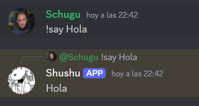
